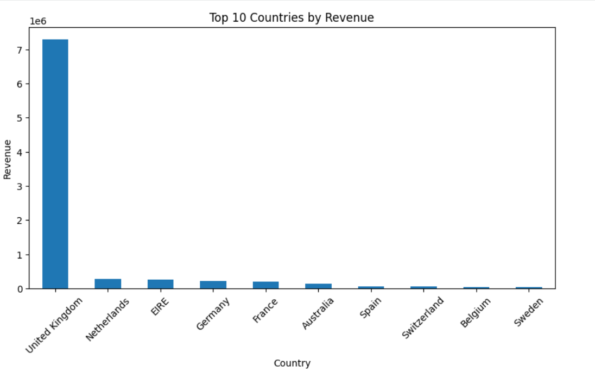
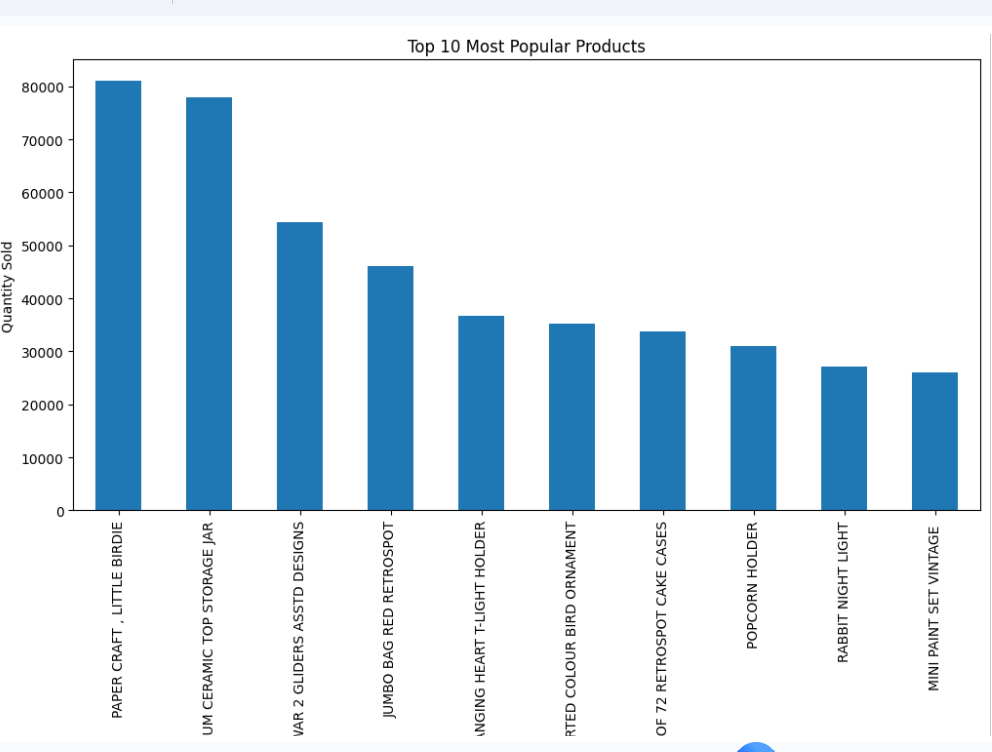
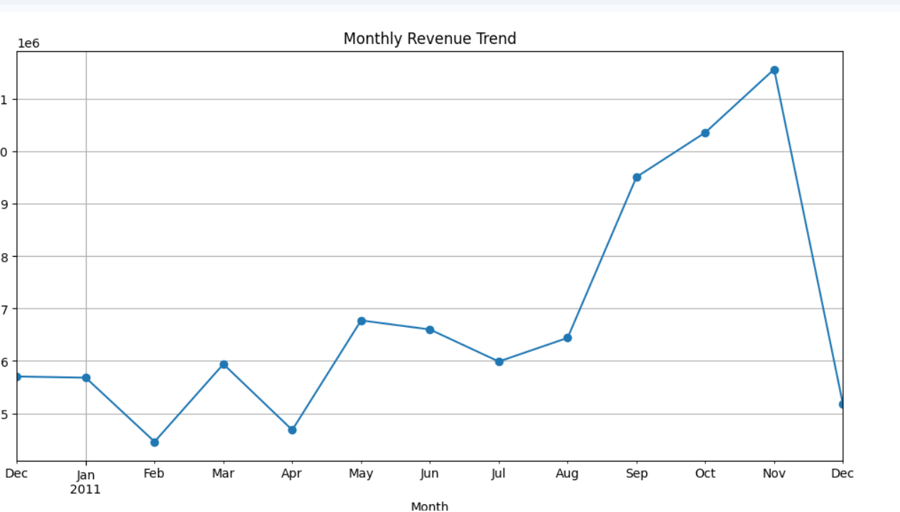
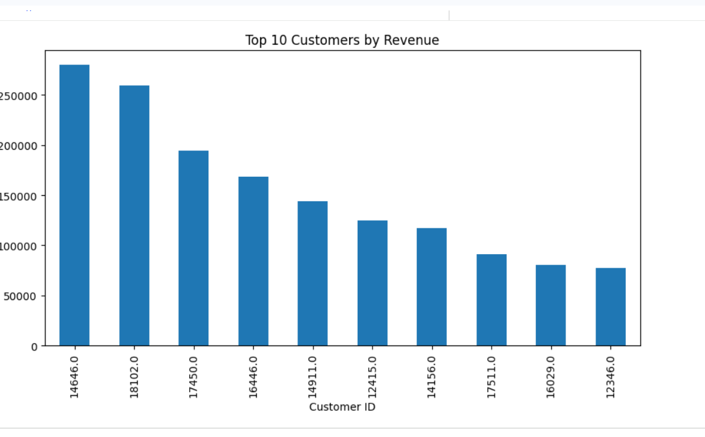

# infotact-group5-data-analytics
# Customer Retention and Sales Analysis using Cohort Analysis on Online Retail Data

## Project Overview

This project analyzes online retail transaction data to understand customer purchasing behavior, revenue trends, product performance, country-wise sales performance, and customer contribution to revenue. The analysis helps identify business opportunities and supports data-driven decision-making.

## Objectives

* Analyze customer purchasing behavior.
* Identify top-performing products.
* Identify top-performing countries.
* Analyze monthly revenue trends.
* Identify high-value customers.
* Generate business insights and recommendations.

## Dataset Description

The dataset contains online retail transaction records, including:

* Invoice Number
* Product Description
* Quantity
* Unit Price
* Customer ID
* Country
* Invoice Date

The dataset is used to analyze sales performance and customer purchasing patterns.

## Tools Used

* Python
* Pandas
* NumPy
* Matplotlib
* Seaborn
* colab Notebook
* GitHub

## Data Cleaning Process

The following data cleaning steps were performed:

* Removed missing values.
* Converted InvoiceDate into datetime format.
* Created a Revenue column using Quantity × UnitPrice.
* Checked and removed duplicate records.
* Verified data types and data consistency.

## EDA Summary

Exploratory Data Analysis (EDA) was performed to understand:

* Revenue generation trends
* Product performance
* Country-wise sales contribution
* Customer purchasing behavior
* Customer revenue contribution

The analysis revealed important patterns in sales performance and customer activity.

## Important Visualizations

### Top 10 Countries by Revenue

**Observation:**
The United Kingdom generates significantly higher revenue compared to all other countries, making it the primary market for the business.

### Top 10 Most Popular Products

**Observation:**
A small number of products contribute a large share of total sales volume. These products are important drivers of customer demand.

### Monthly Revenue Trend

**Observation:**
Revenue fluctuates throughout the year and reaches its highest levels toward the end of the year, indicating seasonal purchasing behavior.

### Top 10 Customers by Revenue

**Observation:**
A small group of customers contributes a significant portion of total revenue. Retaining these customers can improve long-term profitability.

## Key Findings

1. The United Kingdom is the highest revenue-generating country.
2. A few products contribute a large portion of total sales.
3. Revenue shows seasonal patterns across different months.
4. A small number of customers generate a significant share of revenue.
5. Product demand is concentrated among top-selling items.
6. Customer purchasing behavior has a strong impact on overall business performance.

## Business Recommendations

1. Focus on retaining high-value customers through loyalty programs.
2. Promote top-performing products through targeted marketing campaigns.
3. Maintain sufficient inventory for high-demand products.
4. Expand business efforts in high-performing countries.
5. Analyze customer purchasing trends regularly.
6. Use seasonal revenue patterns for better sales planning.
7. Offer personalized promotions to repeat customers.
8. Monitor customer retention and engagement metrics.
9. Improve marketing strategies for lower-performing regions.
10. Use data-driven decision-making to optimize revenue growth.

## Team Members

* Adithyan
* Himabindu
## Conclusion

This project provides valuable insights into customer behavior, revenue trends, product performance, and country-wise sales performance. The findings can help businesses improve customer retention, optimize sales strategies, and increase overall profitability.
