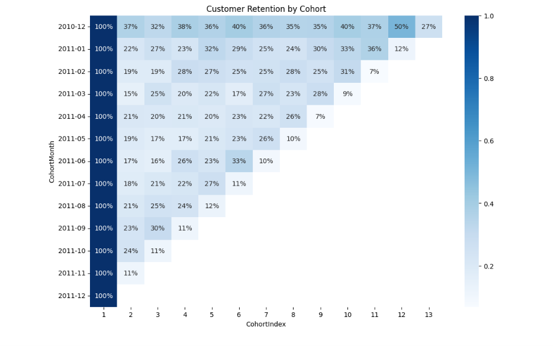
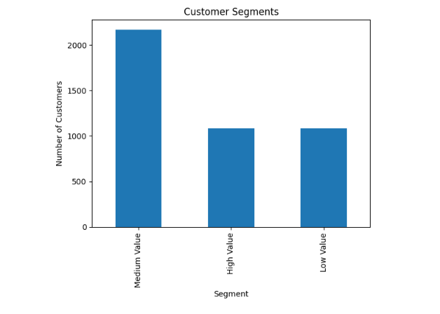
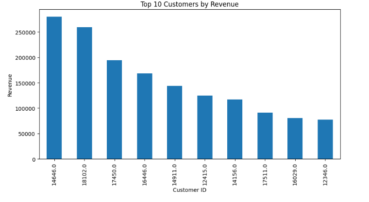
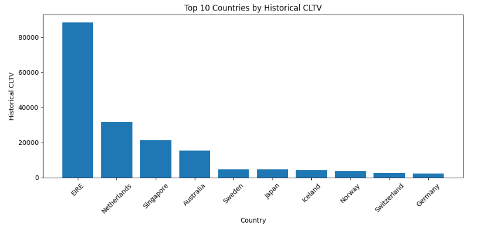

# 📊 SaaS/E-Commerce Cohort Retention & CLTV Analysis

An end-to-end customer analytics project that analyzes online retail transaction data to understand customer behavior, measure customer retention, estimate Customer Lifetime Value (CLTV), and identify high-value customer segments using Cohort Analysis and RFM Analysis.

---

## 📖 Project Overview

Customer retention is a key indicator of business growth and profitability. This project uses the Online Retail dataset to analyze customer purchasing behavior and evaluate how customer retention changes over time.

The project includes data cleaning, exploratory data analysis, cohort retention analysis, customer lifetime value estimation, customer segmentation, and RFM analysis to generate actionable business insights.

---

## 🎯 Objectives

- Clean and preprocess the retail transaction dataset.
- Perform Exploratory Data Analysis (EDA).
- Analyze customer retention using Cohort Analysis.
- Estimate Historical Customer Lifetime Value (CLTV).
- Segment customers based on purchasing behavior.
- Perform RFM (Recency, Frequency, Monetary) Analysis.
- Generate business insights and recommendations.

---

# 📂 Dataset

**Dataset:** Online Retail Dataset

**Source:** Kaggle

The dataset contains transactional records from a UK-based online retailer, including:

- Invoice Number
- Customer ID
- Product Description
- Quantity
- Unit Price
- Invoice Date
- Country

---

# 🛠️ Technologies Used

- Python
- Pandas
- NumPy
- Matplotlib
- Seaborn
- Jupyter Notebook
- Git & GitHub

---

# 📁 Repository Structure

```text
infotact-group5-data-analytics/

│
├── data/
│   ├── raw/
│   │   └── Online Retail.xlsx
│   │
│   └── cleaned/
│       ├── cleaned_retail_day2.csv
│       ├── cleaned_retail_day3.csv
│       └── cohort_ready_dataset.csv
│
├── notebooks/
│   ├── 01_data_cleaning.ipynb
│   ├── 02_eda.ipynb
│   ├── 03_cohort_analysis.ipynb
│   └── 04_cltv_analysis.ipynb
│
├── reports/
│
├── visuals/
│
└── README.md
```

---

# 🔄 Project Workflow

```
Raw Dataset
      │
      ▼
Data Cleaning
      │
      ▼
Exploratory Data Analysis
      │
      ▼
Cohort Analysis
      │
      ▼
Historical CLTV Analysis
      │
      ▼
Customer Segmentation
      │
      ▼
RFM Analysis
      │
      ▼
Business Recommendations
```

---

# 🧹 Data Cleaning

The dataset was cleaned by:

- Removing duplicate records
- Handling missing Customer IDs
- Removing cancelled transactions
- Removing invalid quantity values
- Removing invalid unit prices
- Creating a Sales feature

The cleaned dataset was then used for all subsequent analyses.

---

# 📈 Exploratory Data Analysis (EDA)

The exploratory analysis focused on identifying customer purchasing patterns and sales performance.

### Analyses Performed

- Monthly Revenue Trend
- Top Performing Products
- Top Customers by Revenue
- Top Countries by Revenue
- Purchase Frequency Distribution

These analyses provide an overview of customer behavior and business performance.

---

# 📊 Cohort Analysis

Cohort Analysis groups customers based on the month of their first purchase to measure customer retention over time.

The analysis includes:

- Cohort Month creation
- Cohort Index calculation
- Customer Retention Matrix
- Retention Heatmap
- Cohort Insights

### Example Output

> *(Add your heatmap image after moving it to the `visuals` folder.)*

```markdown

```

---

# 💰 Historical Customer Lifetime Value (CLTV)

Historical CLTV was estimated using customer purchasing behavior.

The notebook includes:

- Average Order Value (AOV)
- Purchase Frequency
- Historical CLTV
- Country-wise Historical CLTV
- Cohort-wise Historical CLTV
- Global vs Segment Comparison

---

# 👥 Customer Segmentation

Customers were segmented based on purchasing value to identify different customer groups.

Segments include:

- High Value
- Medium Value
- Low Value

These segments help businesses design targeted marketing and retention strategies.

---

# ⭐ RFM Analysis

RFM Analysis evaluates customers based on:

- **Recency** – How recently a customer made a purchase.
- **Frequency** – How often the customer makes purchases.
- **Monetary** – How much the customer spends.

This analysis helps identify loyal customers, potential churn risks, and high-value customer groups.

---

# 📷 Project Visualizations

Move your charts into the `visuals` folder and reference them like this.

### Customer Retention Heatmap

```markdown

```

### Customer Segments

```markdown

```

### Top Customers by Revenue

```markdown

```

### Country-wise Historical CLTV

```markdown

```

---

# 💡 Key Business Insights

- Customer retention decreases over time across most cohorts.
- A small number of customers contribute a significant share of total revenue.
- Historical CLTV varies across customer segments and countries.
- High-value customers should be prioritized through personalized retention strategies.
- RFM analysis enables businesses to identify loyal customers and potential churn risks.
- Cohort analysis helps evaluate customer acquisition quality and long-term engagement.

---

# 📌 Business Recommendations

- Develop loyalty programs for high-value customers.
- Re-engage inactive customers through targeted marketing campaigns.
- Focus retention efforts during the first few months after customer acquisition.
- Prioritize marketing in regions with higher customer lifetime value.
- Use customer segmentation to personalize promotional campaigns.
- Continuously monitor customer retention metrics to improve long-term profitability.

---

# 🚀 Future Improvements

Future enhancements may include:

- Predictive Customer Lifetime Value models
- Customer Churn Prediction
- Interactive Power BI Dashboard
- Time Series Sales Forecasting
- Machine Learning-based Customer Segmentation

---

# 👥 Team Members

- **Adithyan A**
- **Himabindu Kondala**

---

# 🙏 Acknowledgements

This project was completed as part of the **Infotact Solutions Data Analytics Internship Program**, applying customer analytics techniques to a real-world retail dataset.

---

## ⭐ If you found this project helpful, consider giving it a star!